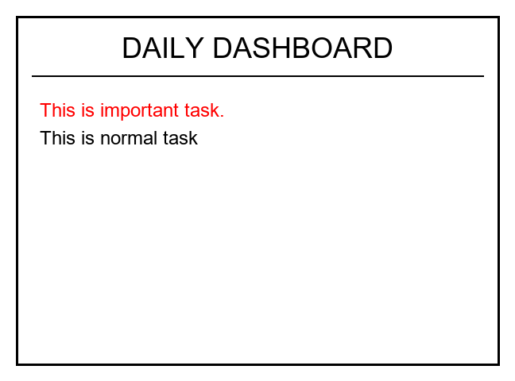
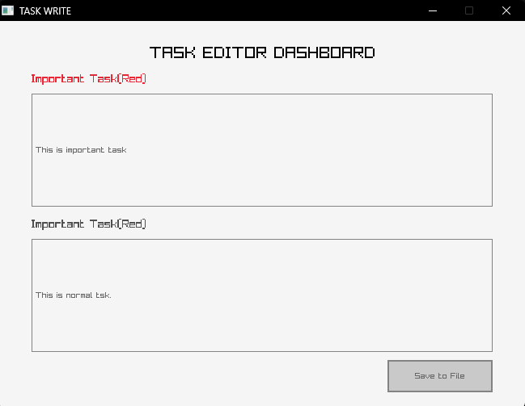
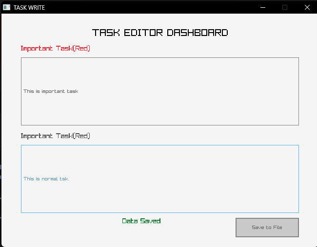

# SCREAAAAMNNN
"SCREAAAAMNNN" is word play for Screen and scream merged together. Screen that is a desktop display for reminders with deadlines and list of task to be done .

## Architecture 

1. C++ Desktop editor(imput.cpp) - A lightweight GUI built using raygui and raylib to input the tasks from the user to "data.txt"
2. Simulation(simul.py) - Reads "data.txt" and renders that a 648*480 visual preview.
3. ESP32 Firmware(main.py) - Runs on micropython , pulls the tasks from "data.txt" and displays on the E ink screen . 

## File Structure

* input.cpp - Desktop task editor
* simul.py - PIL based display simulation
* main.py - ESP32 firmware
* data.txt - data source for the task list (! demotes important task)

## How to use

1. Compile and run the cpp task editor ( requires Raylib,Raygui and mingw)

>g++ .\input.cpp -o input.exe -I"C:\raylib\raylib\src" -L"C:\raylib\raylib\src" -lraylib -lopengl32 -lgdi32 -lwinmm

2. To run the simulation 

>python simul.py

3. Deploying to ESP32

Flash main.py and upload data.txt to the ESP32 using micropython.

## Images 

## Resources 

* Raylib
* Raygui
* Pillow
* Framebuf
* Micropython
